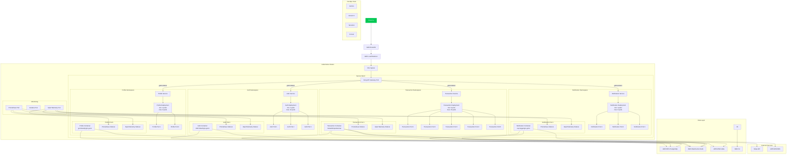

```mermaid
flowchart TB
 subgraph subGraph0["Auth Pod 1"]
        AuthContainer1["Auth Container<br>JWT/OAuth/gin-gonic"]
        AuthMetrics1["Prometheus Sidecar"]
        AuthTrace1["OpenTelemetry Sidecar"]
  end
 subgraph subGraph1["Auth Namespace"]
        AuthDeploy["Auth Deployment<br>min: 3 pods<br>max: 10 pods"]
        AuthSvc["Auth Service"]
        AuthPod1["Auth Pod 1"]
        AuthPod2["Auth Pod 2"]
        AuthPod3["Auth Pod 3"]
        subGraph0
  end
 subgraph subGraph2["Transaction Pod 1"]
        TransContainer1["Transaction Container<br>SAGA/Stripe/decimal"]
        TransMetrics1["Prometheus Sidecar"]
        TransTrace1["OpenTelemetry Sidecar"]
  end
 subgraph subGraph3["Transaction Namespace"]
        TransDeploy["Transaction Deployment<br>min: 5 pods<br>max: 15 pods"]
        TransSvc["Transaction Service"]
        TransPod1["Transaction Pod 1"]
        TransPod2["Transaction Pod 2"]
        TransPod3["Transaction Pod 3"]
        TransPod4["Transaction Pod 4"]
        TransPod5["Transaction Pod 5"]
        subGraph2
  end
 subgraph subGraph4["Notification Pod 1"]
        NotifContainer1["Notification Container<br>zap logger/gin-gonic"]
        NotifMetrics1["Prometheus Sidecar"]
        NotifTrace1["OpenTelemetry Sidecar"]
  end
 subgraph subGraph5["Notification Namespace"]
        NotifDeploy["Notification Deployment<br>min: 3 pods<br>max: 8 pods"]
        NotifSvc["Notification Service"]
        NotifPod1["Notification Pod 1"]
        NotifPod2["Notification Pod 2"]
        NotifPod3["Notification Pod 3"]
        subGraph4
  end
 subgraph subGraph6["Profile Pod 1"]
        ProfContainer1["Profile Container<br>gorm/testify/gin-gonic"]
        ProfMetrics1["Prometheus Sidecar"]
        ProfTrace1["OpenTelemetry Sidecar"]
  end
 subgraph subGraph7["Profile Namespace"]
        ProfDeploy["Profile Deployment<br>min: 2 pods<br>max: 6 pods"]
        ProfSvc["Profile Service"]
        ProfPod1["Profile Pod 1"]
        ProfPod2["Profile Pod 2"]
        subGraph6
  end
 subgraph subGraph8["Service Mesh"]
        Kong["Kong API Gateway Pod"]
        subGraph1
        subGraph3
        subGraph5
        subGraph7
  end
 subgraph Monitoring["Monitoring"]
        Prom["Prometheus Pod"]
        Graf["Grafana Pod"]
        Trace["OpenTelemetry Pod"]
  end
 subgraph subGraph10["Kubernetes Cluster"]
        Ingress["K8s Ingress"]
        subGraph8
        Monitoring
  end
 subgraph subGraph11["External Services"]
        Stripe["Stripe API"]
        SNS["AWS SES/SNS"]
  end
 subgraph subGraph12["Data Layer"]
        RDS["AWS RDS PostgreSQL"]
        ElastiCache["AWS ElastiCache Redis"]
        MSK["AWS MSK Kafka"]
        S3["AWS S3"]
        All["All"]
  end
 subgraph subGraph13["DevOps Tools"]
        Jenkins["Jenkins"]
        GitLab["GitLab CI"]
        Terraform["Terraform"]
        Consul["Consul"]
  end
    Client["Клиенты"] --> Route53["AWS Route53"]
    Route53 --> ALB["AWS Load Balancer"]
    ALB --> Ingress
    Ingress --> Kong
    Kong -- gRPC/REST --> AuthSvc & TransSvc & NotifSvc & ProfSvc
    AuthSvc --> AuthDeploy
    AuthDeploy --> AuthPod1 & AuthPod2 & AuthPod3
    TransSvc --> TransDeploy
    TransDeploy --> TransPod1 & TransPod2 & TransPod3 & TransPod4 & TransPod5
    NotifSvc --> NotifDeploy
    NotifDeploy --> NotifPod1 & NotifPod2 & NotifPod3
    ProfSvc --> ProfDeploy
    ProfDeploy --> ProfPod1 & ProfPod2
    TransContainer1 --> Stripe & RDS & ElastiCache & MSK
    NotifContainer1 --> SNS & ElastiCache & MSK
    AuthContainer1 --> RDS & ElastiCache
    ProfContainer1 --> RDS & ElastiCache
    All --> S3
    Prom --> AuthMetrics1 & TransMetrics1 & NotifMetrics1 & ProfMetrics1
    Trace --> AuthTrace1 & TransTrace1 & NotifTrace1 & ProfTrace1
    style Client stroke:#FFFFFF,fill:#00C853,color:#FFFFFF
```
